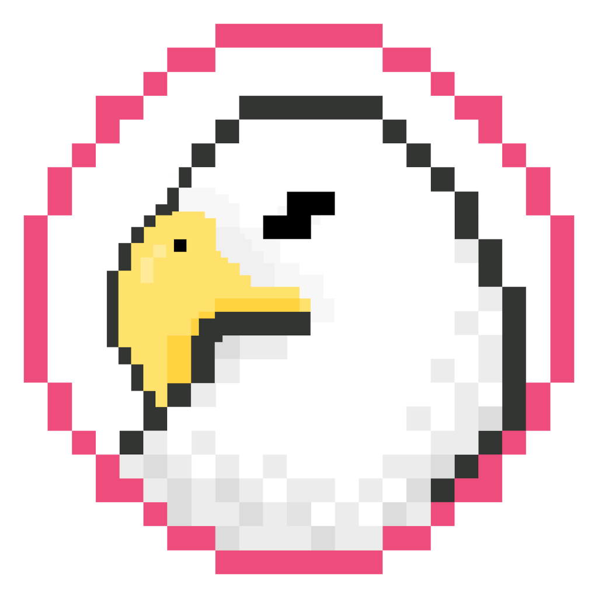

  <h1>ReverseEagle</h1>
  
    

ReverseEagle is a young community thriving to stop monolithic organizations taking over the web and the software we use, for the sake of our privacy, security, freedom and health.

- [Website](https://reverseeagle.org)
- [Codeberg](https://codeberg.org/reverseeagle)
- [Source](https://codeberg.org/reverseeagle/reverseeagle/)

---

This is a placeholder repository, which makes it easier for people to find more information about our project.

Our main repositories are [here.](https://codeberg.org/reverseeagle)
